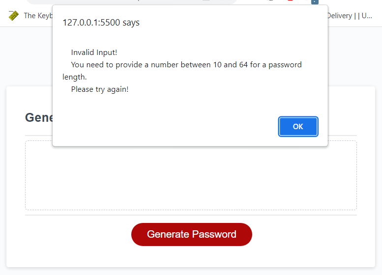
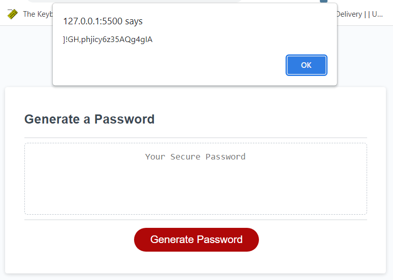

# Password-Generator

## Description

This application can generate a random password for user by simply clicking on the 'Generate Password' button and providing some password requirements from a series of dialog boxes.

A generated password must has 10 to 64 characters with at least one of the following character types:

- lowercase
- uppercase
- numeric
- special characters

Once the password is successfully generated, it will be shown in an alert window and is
also display on the web page for user.
 

## Workflows

This is a what the application looks like on the page. User needs to click on the 'Generate Password' button to start for password generation.

 

User is required to tell the application how many characters for a new password in the dialog.

 

If user doesn't give a valid answer to specify how many characters are needed for a new password, a alert is shown with hint to tell user what is needed.

 

After specifying the number of characters for a new password, a series of alerts will be prompted to ask user what character types are needed for generating a password.

 

If user doesn't choose any of the character types, a alert will be prompted to tell user that at least one character type is needed.

 

Once a password is generated, it will be shown in an alert.

 

The new password is also shown in the DOM.

## Deployment

See the demo in <a href="https://mingzhao91.github.io/Password-Generator" target="_blank">here</a>.
 

## Authors

- **Mingzhao Zhou** - <a href="https://github.com/Mingzhao91" target="_blank">Mingzhao91</a>
   

## License

This project is licensed under the MIT License.
